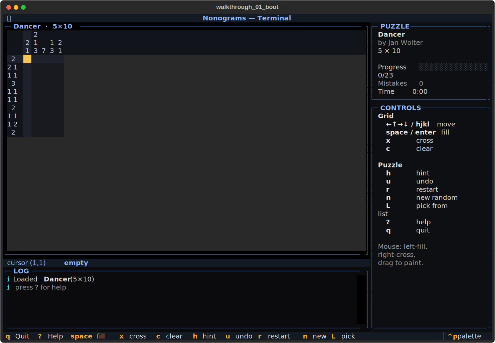
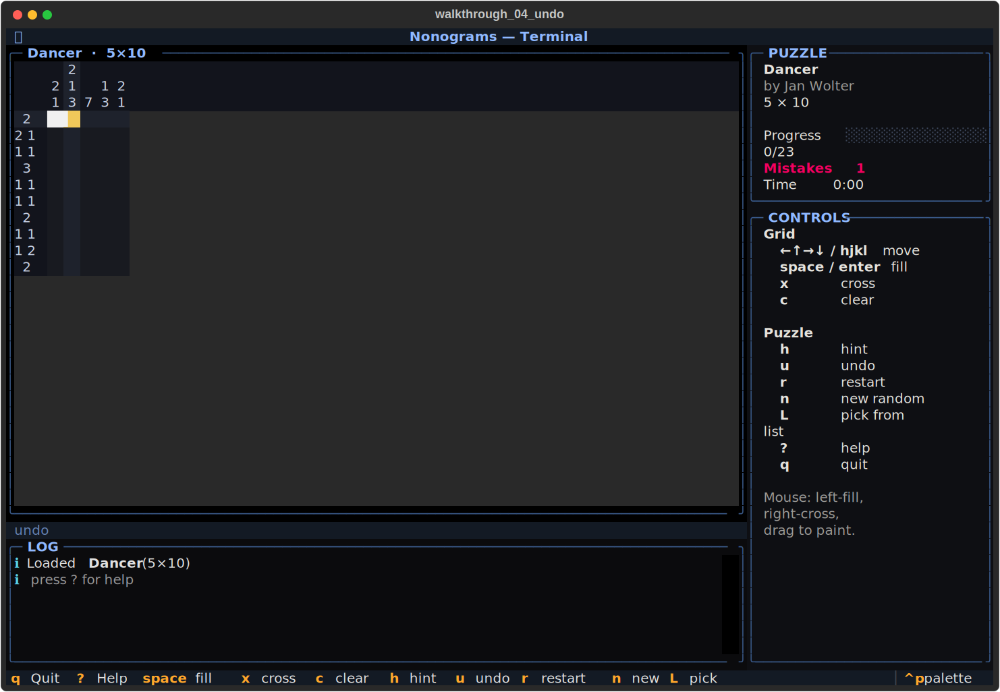
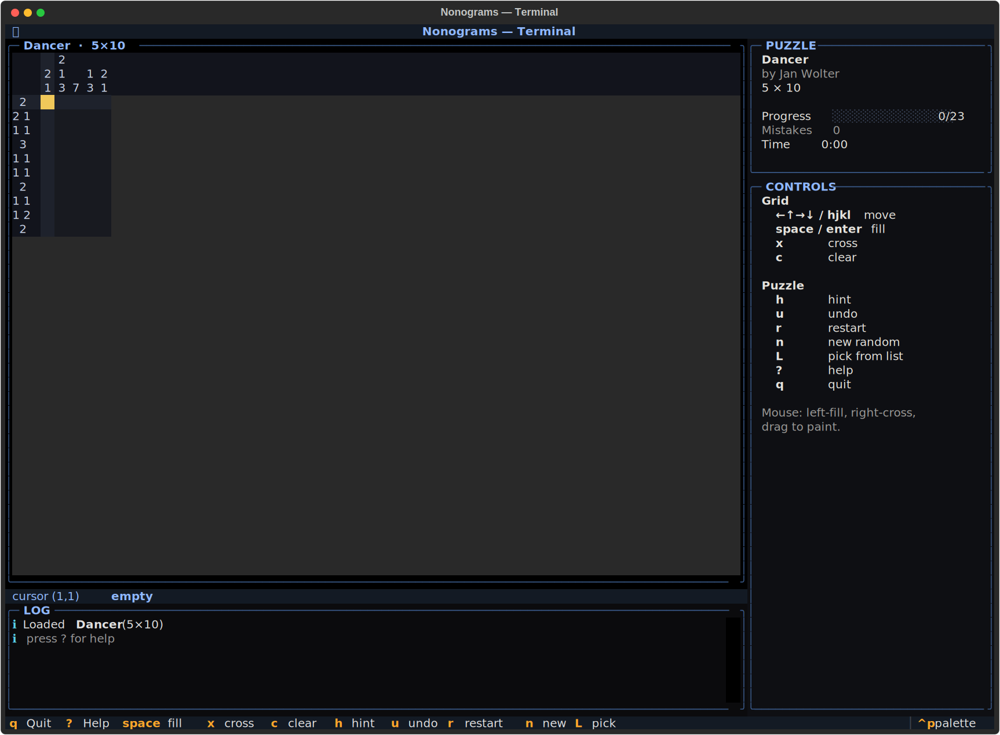

# nonograms-tui
Numbers in. Picture out.





## About
The clues across the rows. The clues down the columns. The empty grid between. Thirty-nine solver-verified Picross puzzles, solver-backed hinting, mouse and keyboard, undo, conflict highlighting, win detection. Turn digits into pictures, one satisfying pixel at a time.

## Screenshots


## Install & Run
```bash
git clone https://github.com/akakabrian/nonograms-tui
cd nonograms-tui
make
make run
```

## Controls
| Keys | Action |
|------|--------|
| `←↑→↓` / `hjkl`    | move cursor |
| `space` / `enter`  | fill / un-fill |
| `x`                | cross / un-cross |
| `c`                | clear cell |
| `h`                | hint (reveal one forced cell) |
| `u`                | undo |
| `r`                | restart this puzzle |
| `n`                | new random puzzle |
| `L`                | pick from list |
| `?`                | help |
| `q`                | quit |

Mouse: left-click fills, right-click crosses, drag-paint on either button.

## Testing
```bash
make test       # QA harness
make playtest   # scripted critical-path run
make perf       # performance baseline
```

## License
GPL-3.0

## Built with
- [Textual](https://textual.textualize.io/) — the TUI framework
- [tui-game-build](https://github.com/akakabrian/tui-foundry) — shared build process
